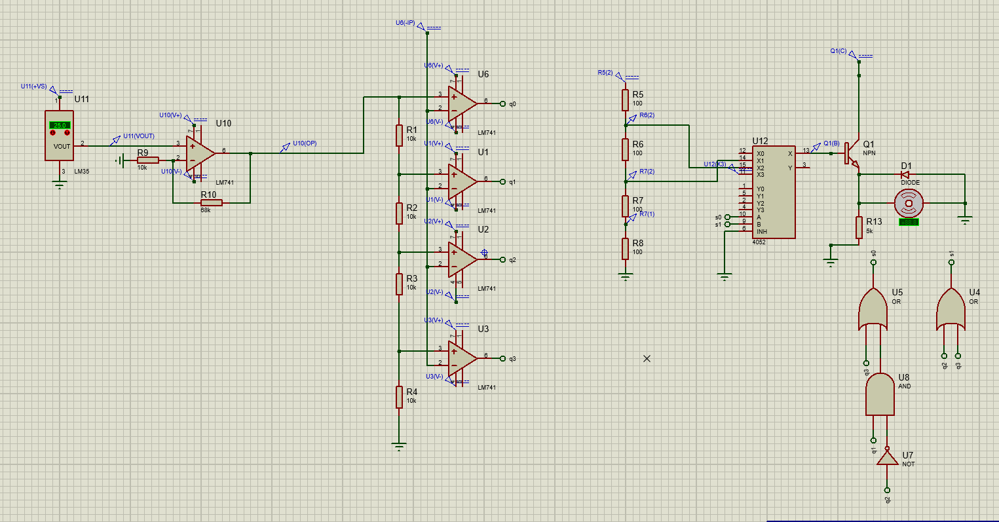
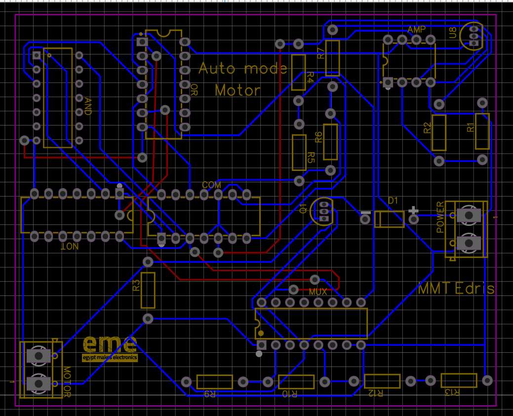
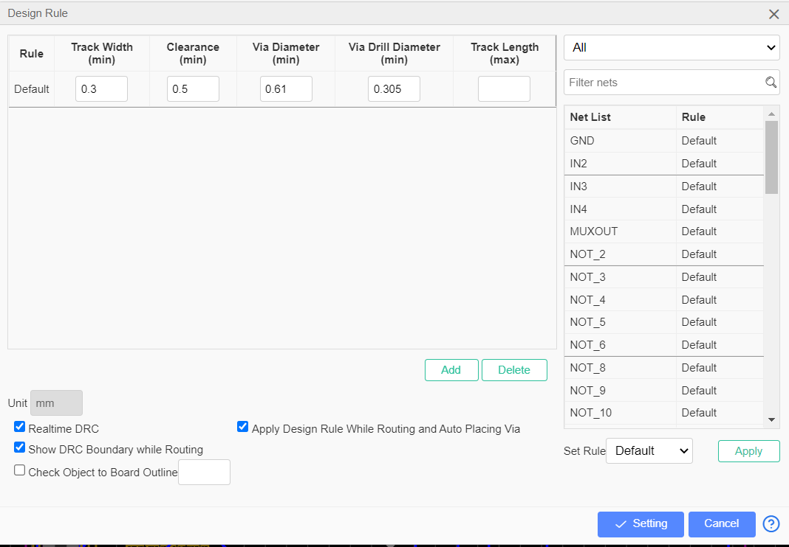
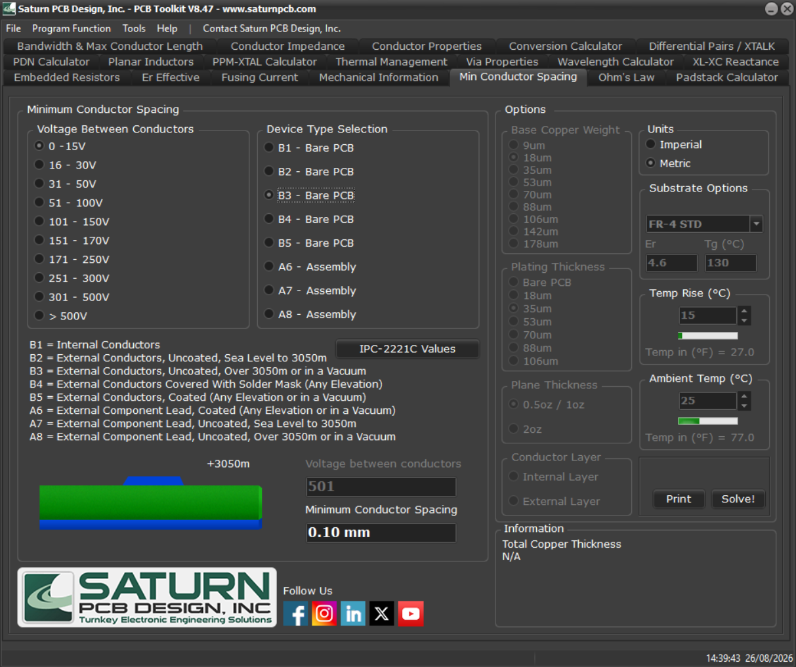
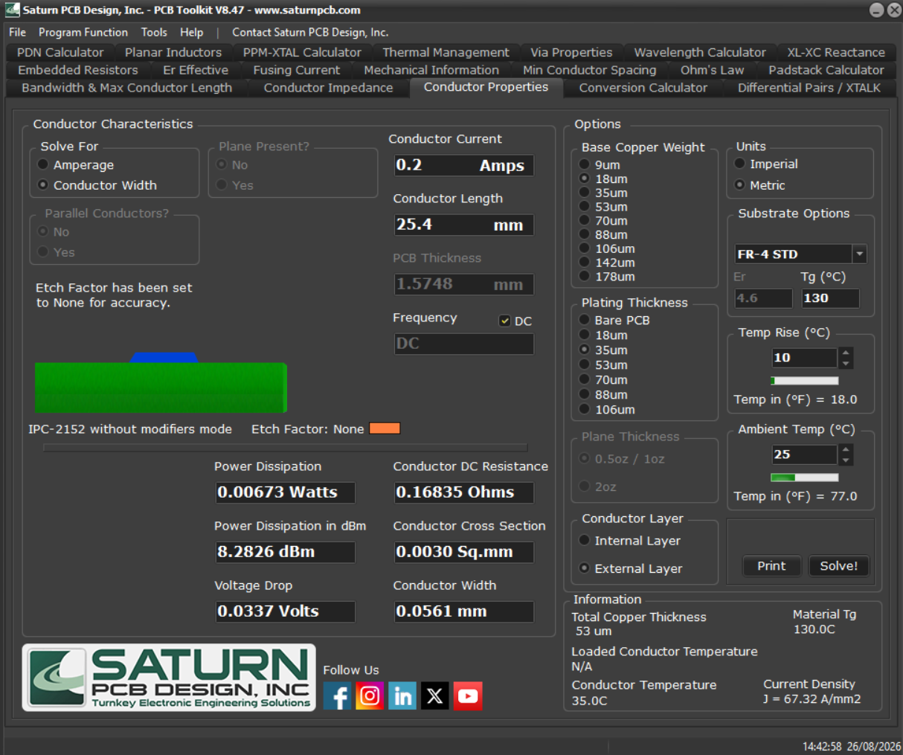

# ⚡ Automatic Multi-Speed Fan Controller (Auto-Mode Fan)
### *A 100% Pure Hardware, MCU-Less Autonomous Closed-Loop Thermal Regulation System*

---

## 📌 Executive Summary

The **Auto-Mode Fan Controller** is a closed-loop thermal regulation system that dynamically controls DC fan velocity based on real-time ambient temperature. 

Unlike modern microcontroller-based designs, this project achieves full autonomy **without microcontrollers, DSPs, firmware, or a single line of software code**. The control loop executes entirely across physical silicon via discrete analog signal conditioning, a 4-level Flash ADC comparator ladder, hardwired combinational logic synthesis, and analog multiplexed power routing.

---

## 💡 Engineering Highlights: Why a Pure Hardware Architecture?

* **Instantaneous Response (Zero Latency):** Temperature shifts trigger immediate physical voltage transitions through the comparator network—completely eliminating polling loops, CPU clock cycles, and interrupt latency.
* **Deterministic Reliability:** Immune to software bugs, stack overflows, watchdog time-outs, and firmware corruption.
* **Minimal Infrastructure:** Eliminates the need for 3.3V/5V digital voltage regulation blocks, clock crystals, programming headers, and bootloader overhead.

### Functional Hardware Replacement Matrix

| MCU / Software Equivalent | Pure Hardware Implementation in this Project | Key Components Deployed |
| :--- | :--- | :--- |
| **ADC Peripheral (`analogRead`)** | 4-Level Parallel Flash ADC Ladder | Resistor Ladder ($10\text{ k}\Omega$) + LM741/LM339 Comparators |
| **Conditional Logic (`if-else` / LUT)** | Discrete Combinational Logic Gate Matrix | SN7432 (OR), MM74HC08 (AND), 74HC04 (NOT) |
| **PWM / Speed Control DAC** | Multi-Tier Analog Voltage Tap Selection | CD4052 Dual 4-Channel Analog Multiplexer |
| **Motor Drive GPIO / Driver Stage** | Discrete BJT Current Booster with Flyback Snubber | 2N2222 NPN Transistor + 1N4007 Diode |

---

## 🔌 Circuit Architecture & Mathematical Analysis

  
  
<em>Figure 2: Complete schematic capture showing analog processing, logic decoding, and power drive stages.</em>

### Stage 1: Transduction & Non-Inverting Amplification
An **LM35DZ** precision temperature sensor outputs a linear scale of $10\text{ mV}/^\circ\text{C}$:
$$V_{sensor}(T) = 10\text{ mV}/^\circ\text{C} \times T$$

To lift low-level millivolt signals into a wide dynamic comparison range, an **LM741** operational amplifier is configured in a non-inverting topology with feedback resistor $R_{10} = 68\text{ k}\Omega$ and ground resistor $R_9 = 10\text{ k}\Omega$:
$$A_v = 1 + \frac{R_{10}}{R_9} = 1 + \frac{68\text{ k}\Omega}{10\text{ k}\Omega} = 7.8$$
$$V_{amp}(T) = A_v \times V_{sensor}(T) = 7.8 \times (0.010 \times T) = 0.078 \times T\text{ [V]}$$
* **Calibration Check at $25^\circ\text{C}$:**  
  $$V_{sensor} = 25 \times 10\text{ mV} = 0.25\text{ V} \implies V_{amp} = 7.8 \times 0.25\text{ V} = 1.95\text{ V}$$

### Stage 2: 4-Level Flash ADC Conversion
The amplified signal $V_{amp}$ is routed simultaneously to the non-inverting (+) inputs of 4 parallel comparators (LM339/LM741). A precision resistor ladder ($R_1 - R_4 = 10\text{ k}\Omega$) sets 4 uniform reference thresholds ($\approx 0.8\text{ V}$ step size), producing a 4-bit thermometer code output ($q_0, q_1, q_2, q_3$).

### Stage 3: Combinational Logic Addressing
Instead of deploying an multiplexer priority encoder IC, a minimalist discrete gate network synthesizes the 2-bit channel selection lines ($S_0, S_1$) to address the multiplexer:
$$S_0 = q_3 + (q_1 \cdot \overline{q_2})$$
$$S_1 = q_2 + q_3$$
* Synthesized physically using one NOT inverter, one 2-input AND gate, and two 2-input OR gates.

### Stage 4: Multiplexed Speed Control & Power Driving
A **CD4052** dual 4-channel analog multiplexer routes one of 4 preset voltage taps from a dedicated speed-divider ladder ($R_5 - R_8 = 100\,\Omega$):
* **BJT Current Booster:** Because the CD4052 channel resistance cannot supply motor stall/startup currents, an NPN transistor (**2N2222**) acts as an emitter-follower/current amplifier.
* **Flyback Protection:** A **1N4007** diode is connected antiparallel across the motor terminals to clamp inductive kickback spikes and prevent BJT collector-emitter breakdown.

---

## 📊 System Truth Table & Operating Modes

| Operational Mode | Thermal Threshold | Thermometer Code ($q_3 q_2 q_1 q_0$) | $S_1$ (MSB) | $S_0$ (LSB) | Selected MUX Tap | Fan Speed State |
| :--- | :---: | :---: | :---: | :---: | :---: | :--- |
| **Idle / Off** | $T < \text{Level 1}$ | `0000` | 0 | 0 | $X_0$ (Tap 0) | Off / Minimum Idle |
| **Low Speed** | $\text{Level 1} \le T < \text{Level 2}$ | `0011` (or `0001`) | 0 | 1 | $X_1$ (Tap 1) | Low RPM Cooling |
| **Medium Speed** | $\text{Level 2} \le T < \text{Level 3}$ | `0111` | 1 | 0 | $X_2$ (Tap 2) | Medium RPM Cooling |
| **Max Cooling** | $T \ge \text{Level 3}$ | `1111` | 1 | 1 | $X_3$ (Tap 3) | Full Boost RPM |

---

## 🛠️ PCB Layout & Manufacturing Standards

  
  
<em>Figure 3: Two-layer PCB routing layout (Top layer: Blue, Bottom layer: Red).</em>

### Design Rule Check (DRC) Constraints

| Parameter | CAD Constraint Value | Engineering Justification |
| :--- | :---: | :--- |
| **Minimum Track Width** | 0.30 mm | Ensures mechanical trace stability and current carrying margin |
| **Minimum Clearance** | 0.50 mm | Exceeds IPC dielectric isolation rules for noise rejection |
| **Via Outer Diameter** | 0.61 mm | Robust annular ring integrity for CNC prototyping |
| **Via Drill Diameter** | 0.305 mm | Reliable mechanical drilling aspect ratio |

  
  
<em>Figure 4: Global Design Rule configuration used during CAD layout routing.</em>

### IPC Standard Verification (via Saturn PCB Toolkit)

* **IPC-2221 (Conductor Spacing):** Calculated worst-case spacing for Class B3 ($>3050\text{ m}$ altitude) is **0.10 mm**. The board's **0.50 mm** clearance provides a **+400% safety margin**.
* **IPC-2152 (Current Capacity):** For a motor load of $0.2\text{ A}$ DC, the calculated required trace width is **0.0561 mm**. The implemented **0.30 mm** trace width provides a **+434% capacity buffer**.

  
  
  
<em>Figure 5: Calculations from Saturn PCB Toolkit validating thermal and isolation margins.</em>

---

## 📦 Bill of Materials (BOM)

| Designator | Component | Package | Functional Description |
| :--- | :--- | :--- | :--- |
| **U11** | LM35DZ | TO-92 | Linear Precision Analog Thermal Transducer ($10\text{ mV}/^\circ\text{C}$) |
| **U10** | LM741N | DIP-8 | Non-Inverting Signal Pre-Amplifier ($A_v = 7.8$) |
| **U4** | LM339J / LM741 | DIP-14 / DIP-8 | Quad Comparator Array (4-Level Flash ADC) |
| **U5, U7, U8** | 74HC Series | DIP-14 | Discrete Logic Gates (74HC04 NOT, MM74HC08 AND, SN7432 OR) |
| **U12** | CD4052B | DIP-16 | Dual 4-Channel Analog Multiplexer / Demultiplexer |
| **Q1** | 2N2222 | TO-92 | NPN BJT High-Current Driver Stage |
| **D1** | 1N4007 | DO-41 | Inductive Flyback Clamping Diode |
| **R9, R10** | Metal Film | Axial ($10\text{ k}\Omega, 68\text{ k}\Omega$) | Op-Amp Gain Setting Network |
| **R1 - R4** | Metal Film | Axial ($10\text{ k}\Omega \times 4$) | Flash ADC Threshold Voltage Ladder |
| **R5 - R8** | Power Resistors | Axial ($100\,\Omega \times 4$) | Multi-Speed Discrete Voltage Tap Divider |
| **J1, J2** | Terminal Blocks | 2-Pin 5.0mm Pitch | High-Current Screw Terminals for Power Input & DC Fan |

---

## 📂 Project Assets & Verification Deliverables

* **Engineering Report:** [`docs/Auto_Mode_Fan_Technical_Report.pdf`](docs/Auto_Mode_Fan_Technical_Report.pdf)
* **PCB Documentation:** [`docs/PCB_Technical_Documentation.docx`](docs/PCB_Technical_Documentation.docx)
* **Proteus Simulation File:** [`simulation/Task1_Mohamed_Mostafa.pdsprj`](simulation/Task1_Mohamed_Mostafa.pdsprj) (Open with Proteus 8.x+)
* **Fabrication Files (Gerber):** [`hardware/Gerber_task1PCB_4_2026-08-26.zip`](hardware/Gerber_task1PCB_4_2026-08-26.zip) (Ready for direct PCB manufacturing)

---

## 👤 Authorship & Academic Supervision

* **Authors:** Mohamed Mostafa Nasr & Mohamed Nasser
* **Academic Supervisor:** Eng. Mahmoud Mohamed
